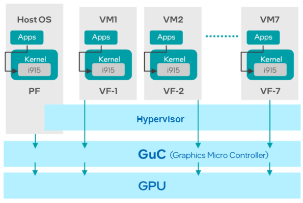
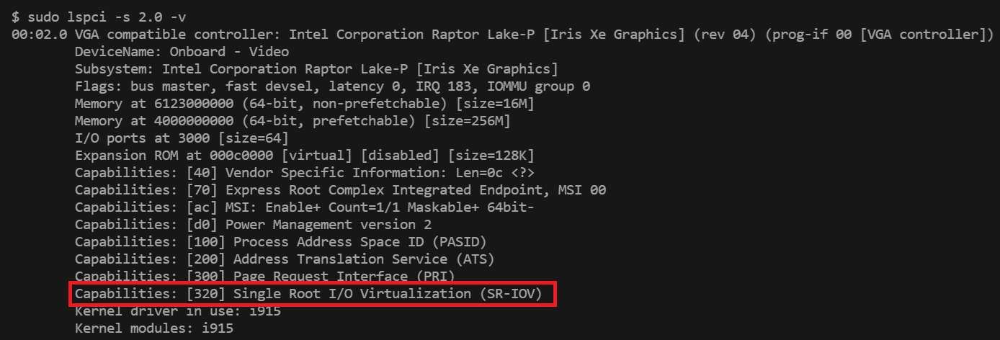
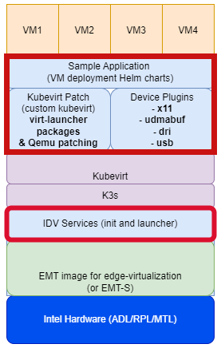

# Desktop Virtualization with Graphics SR-IOV

[](https://opensource.org/licenses/Apache-2.0)
[](https://scorecard.dev/viewer/?uri=github.com/open-edge-platform/edge-desktop-virtualization)
[](https://github.com/open-edge-platform/edge-desktop-virtualization/actions/workflows/github-code-scanning/codeql)
[](https://github.com/open-edge-platform/edge-desktop-virtualization/actions/workflows/device_plugin_coverity.yaml)

- [Desktop Virtualization with Graphics SR-IOV](#desktop-virtualization-with-graphics-sr-iov)
  - [Overview](#overview)
    - [How it works](#how-it-works)
    - [Key Features](#key-features)
    - [System requirements:](#system-requirements)
      - [Recommended Hardware Configuration](#recommended-hardware-configuration)
    - [Host OS Options](#host-os-options)
    - [Generate Virtual Machine qcow2 with required drivers for SR-IOV](#generate-virtual-machine-qcow2-with-required-drivers-for-sr-iov)
  - [K3s/Kubevirt Solution stack for Edge Desktop Virtualization](#k3skubevirt-solution-stack-for-edge-desktop-virtualization)
    - [IDV Services](#idv-services)
    - [Device Plugins for Kubernetes](#device-plugins-for-kubernetes)
    - [Kubevirt Patch](#kubevirt-patch)
    - [Sample Application : VM deployment Helm charts](#sample-application--vm-deployment-helm-charts)
  - [References](#references)

## Overview

Intel's Single Root I/O Virtualization (SR-IOV) for graphics is a technology that allows a single physical Intel graphics processing unit (GPU) to be presented as multiple virtual devices to different virtual machines (VMs). This enables efficient GPU resource sharing and improves performance for graphics-intensive workloads within virtualized environments

### How it works

- The Physical Function (PF) is the full-featured physical function of the GPU, managed by the host OS. 
- Virtual functions (VFs) are created from the PF and assigned to individual VMs.
- Each VF provides a dedicated and isolated path for data transfer to and from the VM, bypassing the host's hypervisor for improved performance and reducded latency.
- PCIe Standard: SR-IOV is a PCI-SIG standard that defines how a single physical PCIe device can be presented as multiple virtual devices. 

<p align="center">

</p>
<p align="center">
<em>Graphics SR-IOV Architecture</em>
</p>

### Key Features

- **Improved performance:** Direct access to the GPU hardware for each VM reduces overhead and latency, particularly for tasks like video transcoding and media processing.
- **Efficient resource utilization:** SR-IOV enables better sharing of GPU resources among multiple VMs, maximizing the utilization of a single physical GPU.
- **Support for cloud-native environments:** SR-IOV is crucial for enabling GPU acceleration in Kubernetes and other cloud platforms.

### System requirements:

SR-IOV for Intel graphics typically requires hardware generation of Alder Lake (12th Gen Intel Core) or newer.
One can check if your Intel graphics controller supports SR-IOV by executing below command for the Single Root I/O Virtualization (SR-IOV) PCI capability
 ```sh
 sudo lspci -s 2.0 -v
 ```


#### Recommended Hardware Configuration

| Component    | Edge Microvisor Toolkit + graphics SR-IOV|
|--------------|------------------------------------------|
| CPU          | Intel® Core (12th gen and higher)        |
| RAM          | 64GB recommended                         |
| Storage      | 500 GB SSD or NVMe minimum               |
| Networking   | 1GbE Ethernet                            |

### Host OS Options

Host OS has to be enabled with graphics SR-IOV ingredients.
Below are various options (but not limited to) :
- #### EMT - Intel EMT with [desktop-virtualization Image config](https://github.com/open-edge-platform/edge-microvisor-toolkit/blob/70d364596e88ad332637d7073a7a0a445960ca39/toolkit/imageconfigs/edge-image-desktop-virtualization.json)
- #### Debian - [ThunderSoft SR-IOV](https://github.com/ThunderSoft-SRIOV)
- #### Ubuntu
  - [kvm multi-os](https://github.com/intel/kvm-multios/blob/main/documentation/setup_sriov.md)
  - [12th Gen](https://www.intel.com/content/www/us/en/secure/content-details/680834/12th-gen-intel-core-mobile-processors-code-named-alder-lake-p-12th-gen-intel-core-desktop-processors-code-named-alder-lake-s-multi-os-with-graphics-sr-iov-virtualization-on-ubuntu-user-guide.html?wapkw=multi-os%20graphics%20SRIOV&DocID=680834)
  - [13th Gen](https://www.intel.com/content/www/us/en/secure/content-details/762237/13th-gen-intel-core-mobile-processors-for-iot-edge-code-named-raptor-lake-p-multi-os-with-graphics-sr-iov-virtualization-on-ubuntu-user-guide.html?wapkw=multi-os%20graphics%20SRIOV)
  - [Core Ultra PS Series (Meteor Lake)](https://www.intel.com/content/www/us/en/secure/content-details/780205/reference-implementation-of-intel-core-ultra-processor-intel-core-ultra-processor-ps-series-formerly-known-as-meteor-lake-u-h-ps-multi-os-with-graphics-sr-iov-virtualization-on-ubuntu-user-guide.html?wapkw=multi-os%20graphics%20SRIOV)


### Generate Virtual Machine qcow2 with required drivers for SR-IOV

- #### [Windows](https://github.com/ThunderSoft-SRIOV/sriov/blob/main/docs/deploy-windows-vm.md#microsoft-windows-11-vm)
- #### [Ubuntu](https://github.com/ThunderSoft-SRIOV/sriov/blob/main/docs/deploy-ubuntu-vm.md)

## K3s/Kubevirt Solution stack for Edge Desktop Virtualization

Below are the ingredients to achieve Display and Graphics Virtualization pipeline using SR-IOV.

<p align="center">

</p>
<p align="center">
<em>Desktop Virtualization on K3s/Kubevirt</em>
</p>

The components marked in red are in scope of this solution. 
The display and graphics virtualization pipeline on k3s/kubevirt can be realized by following build and installation of below components.

### [IDV Services](idv-services/README.md)
### [Device Plugins for Kubernetes](device-plugins-for-kubernetes/README.md)
### [Kubevirt Patch](kubevirt-patch/README.md)
### Sample Application : VM deployment Helm charts
   - #### [Discrete Helm charts](sample-application/discrete/README.md)
   - #### [Single Helm deployment](sample-application/single/README.md)

## References
- [Reference-1](https://cyberus-technology.de/en/articles/vbox-kvm-sriov)
- [Reference-2](https://www.dfi.com/Uploads/DownloadCenter/5631e304-28b2-4256-975a-5689750b5636/Intel%20iGPU%20(Integrated%20Graphics)%20SR-IOV%20-%20The%20Catalyst%20for%20IoT%20Virtualization%20in%20Factory%20Automation.pdf?timestamp=1676441838.9072)
- [Reference-3](https://www.intel.com/content/www/us/en/secure/content-details/782115/intelligent-desktop-virtualization-idv.html?wapkw=intelligent%20desktop%20virtualization&DocID=782115)
- [Reference-4](https://www.intel.com/content/www/us/en/secure/content-details/657261/sr-iov-based-graphics-virtualization.html?wapkw=intelligent%20desktop%20virtualization&DocID=657261)
- [References-5](https://github.com/intel/kubevirt-gfx-sriov)
- [References-6](https://dgpu-docs.intel.com/devices/hardware-table.html)
