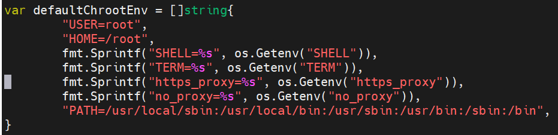

# Edge Desktop Virtualization

## [IDV Services](idv-services/README.md)
## [Device Plugins for Kubernetes](device-plugins-for-kubernetes/README.md)
## [Kubevirt Patch](kubevirt-patch/README.md)
## Sample Application : VM deployment Helm charts
   ### [Discrete Helm charts](sample-application/discrete/README.md)
   ### [Single Helm deployment](sample-application/single/README.md)

# Desktop Virtualization solution with graphics SR-IOV

## Table of Contents
- [Edge Desktop Virtualization](#edge-desktop-virtualization)
  - [IDV Services](#idv-services)
  - [Device Plugins for Kubernetes](#device-plugins-for-kubernetes)
  - [Kubevirt Patch](#kubevirt-patch)
  - [Sample Application : VM deployment Helm charts](#sample-application--vm-deployment-helm-charts)
    - [Discrete Helm charts](#discrete-helm-charts)
    - [Single Helm deployment](#single-helm-deployment)
- [Desktop Virtualization solution with graphics SR-IOV](#desktop-virtualization-solution-with-graphics-sr-iov)
  - [Table of Contents](#table-of-contents)
  - [Pre-requisites](#pre-requisites)
    - [System Requirements](#system-requirements)
      - [Recommended Hardware Configuration](#recommended-hardware-configuration)
    - [Build EMT](#build-emt)
      - [Pre-requisite](#pre-requisite)
      - [Image Build Steps](#image-build-steps)
    - [Install EMT](#install-emt)
    - [Generate Virtual Machine qcow2 with required drivers for SR-IOV](#generate-virtual-machine-qcow2-with-required-drivers-for-sr-iov)
    - [Further steps](#further-steps)

## Pre-requisites

### System Requirements

Edge Microvisor Toolkit + Graphics SR-IOV is designed to support all Intel® Core platforms from 12th gen onwards.

This software is validated on below:

|         Core™         |
| ----------------------|
| 12th Gen Intel® Core™ |
| 13th Gen Intel® Core™ |

#### Recommended Hardware Configuration

| Component    | Edge Microvisor Toolkit + graphics SR-IOV|
|--------------|-----------------------------------|
| CPU          | Intel® Core (12th gen and higher) |
| RAM          | 64GB recommended                  |
| Storage      | 500 GB SSD or NVMe minimum        |
| Networking   | 1GbE Ethernet                     |


### Build EMT

Reference to the build steps as mentioned here : [EMT Image build](https://github.com/smitesh-sutaria/edge-microvisor-toolkit/blob/3.0/docs/developer-guide/get-started/building-howto.md)

#### Pre-requisite
- Ubuntu 22.04
- Install the dependencies mentioned [here](https://github.com/open-edge-platform/edge-microvisor-toolkit/blob/3.0/toolkit/docs/building/prerequisites-ubuntu.md)

#### Image Build Steps

**Step 1: Clone EMT repo**
```bash
git clone https://github.com/open-edge-platform/edge-microvisor-toolkit.git
# checkout to the 3.0 tag
git checkout 3.0.20250411
```
**Step 2: Edit the Chroot env in the go code [toolkit/tools/internal/safechroot/safechroot.go](https://github.com/open-edge-platform/edge-microvisor-toolkit/blob/3.0.20250411/toolkit/tools/internal/safechroot/safechroot.go)**
```go
# add the following lines under "defaultChrootEnv" variable declaration, after the line 102
fmt.Sprintf("https_proxy=%s", os.Getenv("https_proxy")),
fmt.Sprintf("no_proxy=%s", os.Getenv("no_proxy")),
```
It should look something like this


**Step 3: Build the toolkit**
```bash
cd edge-microvisor-toolkit/toolkit
sudo -E  make toolchain REBUILD_TOOLS=y
```
**Step 4: Build the image**
Build EMT image for graphics SR-IOV using the spec [edge-image-mf-dev.json](https://github.com/open-edge-platform/edge-microvisor-toolkit/blob/3.0-dev/toolkit/imageconfigs/edge-image-mf-dev.json)
```bash
sudo -E make image -j8 REBUILD_TOOLS=y REBUILD_PACKAGES=n CONFIG_FILE=imageconfigs/edge-image-mf-dev.json
# created image will be available under "edge-microvisor-toolkit/out/images/edge-image-mf-dev"
```
> ⚠️ **Note: Please remove "intel" related proxy from "no_proxy" system env variable before step 3**

### Install EMT

To Flash EMT DV image on a NUC follow [EMT image installation docs](https://github.com/intel-innersource/applications.virtualization.maverickflats-tiberos-itep/blob/vm_sidecar_dev_plugin/tiber/tiber_flash_partition.md)

To verify checkout [Other methods](https://github.com/smitesh-sutaria/edge-microvisor-toolkit/blob/3.0/docs/developer-guide/get-started/installation-howto.md)

### Generate Virtual Machine qcow2 with required drivers for SR-IOV

Follow the qcow2 creation for windows till post install launch from this readme.

https://github.com/ThunderSoft-SRIOV/sriov/blob/main/docs/deploy-windows-vm.md#microsoft-windows-11-vm

### Further steps

For further steps to launch VMs, refer the README [here](idv-services/README.md)

