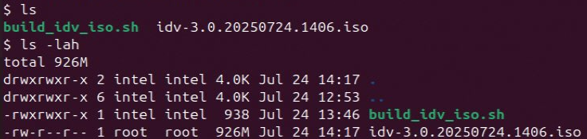

<!-- Copyright (C) 2025 Intel Corporation -->
# Building EMT ISO with Desktop Virtualization (graphics SR-IOV)

- [Building EMT ISO with Desktop Virtualization (graphics SR-IOV)](#building-emt-iso-with-desktop-virtualization-graphics-sr-iov)
  - [Using Standalone Build Script (Automated)](#using-standalone-build-script-automated)
    - [Run the script as sudo](#run-the-script-as-sudo)
    - [ISO file will be generated in the same path](#iso-file-will-be-generated-in-the-same-path)
    - [Refer the demo below](#refer-the-demo-below)
  - [Manual Steps](#manual-steps)
    - [Pre-requisite](#pre-requisite)
    - [Step 1: clone the EMT repo](#step-1-clone-the-emt-repo)
    - [Step 2: Checkout the tag](#step-2-checkout-the-tag)
    - [Step 3: Copy the idv.json to edge-microvisor-toolkit/toolkit/imageconfigs/](#step-3-copy-the-idvjson-to-edge-microvisor-toolkittoolkitimageconfigs)
    - [Step 4: Build the tools](#step-4-build-the-tools)
    - [Step 5: Build the ISO for desktop virtualization (IDV)](#step-5-build-the-iso-for-desktop-virtualization-idv)
    - [Troubleshoot](#troubleshoot)
      - [Clean build](#clean-build)
      - [Working with Proxies](#working-with-proxies)

## Using Standalone Build Script (Automated)

> Prerequisite : Ubuntu 22.04 or Ubuntu 24.04

### Run the script as sudo
```sh
sudo ./build_idv_iso.sh
```
### ISO file will be generated in the same path

<p align="left">

</p>
<p align="center">
<em></em>
</p>

### Refer the demo below

https://github.com/user-attachments/assets/8e3f609b-9632-4ea6-807d-1560856a20db

## Manual Steps

The image configuration is part of this repo [here](./idv.json)

### Pre-requisite

[Build Requirements](https://github.com/open-edge-platform/edge-microvisor-toolkit/blob/3.0/toolkit/docs/building/prerequisites-ubuntu.md#build-requirements-on-ubuntu)

> It is recommended to built against a stable/release tag.

### Step 1: clone the EMT repo
```sh
git clone https://github.com/open-edge-platform/edge-microvisor-toolkit
```
### Step 2: Checkout the tag
```sh
git checkout tags/<tag_name>
```
### Step 3: Copy the idv.json to edge-microvisor-toolkit/toolkit/imageconfigs/
```sh
cp idv.json edge-microvisor-toolkit/toolkit/imageconfigs/
```
### Step 4: Build the tools
```sh
cd edge-microvisor-toolkit/toolkit
sudo make toolchain REBUILD_TOOLS=y
```
### Step 5: Build the ISO for desktop virtualization (IDV) 
```sh
sudo make iso -j8 REBUILD_TOOLS=y REBUILD_PACKAGES=n CONFIG_FILE=./imageconfigs/idv.json
```

### Troubleshoot

#### Clean build

> For re-building with any other tags, its recommended to start clean and repeat above Steps 1 to 5.
> ```sh
> cd edge-microvisor-toolkit
> sudo make -C toolkit clean
> ```

#### Working with Proxies

> If you are behind proxies and have them set, use -E option with all make commands
> For ex :
> ```
> sudo -E make toolchain REBUILD_TOOLS=y
> sudo -E make iso -j8 REBUILD_TOOLS=y REBUILD_PACKAGES=n CONFIG_FILE=./imageconfigs/idv.json
> ```
